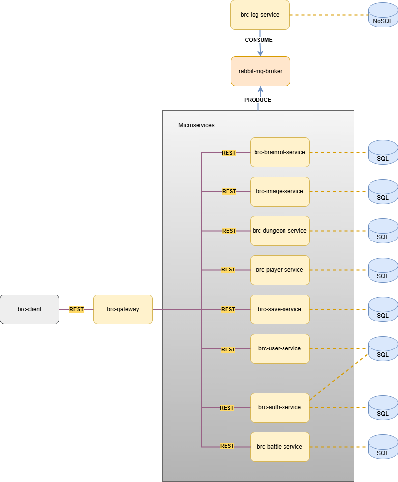

# Brain Rot Chronicles : The Aura Farming Expedition

# Installation et Lancement

## 1. Clonage des dépôts
Clonez les deux dépôts brc-gateway et brc-web :
```bash
git clone  https://github.com/Brain-Rot-RPG/brc-gateway.git
git clone https://github.com/Brain-Rot-RPG/brc-web.git

```

## 2. Configuration de l'environnement (Gateway)

Accédez au dossier de la gateway et préparez les variables d'environnement :

* Allez dans le dossier `brc-gateway`.
* Créez un fichier `.env` à partir du modèle fourni :
```bash
cp .env.example .env

```

## 3. Authentification GitHub Container Registry (GHCR)

Pour permettre à Docker de récupérer les images nécessaires, vous devez vous authentifier :

1. **Générer un Token :**
* Allez sur GitHub : **Settings** > **Developer Settings** > **Personal access token** > **Tokens (classic)**.
* Cliquez sur **Generate new token (classic)**.
* Sélectionnez les scopes : `repo` et `read:packages`.
* **Copiez le jeton** généré.


2. **Connexion via le terminal :**
Exécutez la commande suivante en remplaçant les placeholders :
```bash
echo "VOTRE_TOKEN_ICI" | docker login ghcr.io -u VOTRE_USERNAME --password-stdin

```

## 4. Lancement de l'infrastructure

Depuis le dossier `brc-gateway`, lancez les services Docker (Bases de données, etc.) :

```bash
docker-compose up -d --build

```

## 5. Démarrage des services

Une fois l'infrastructure prête, lancez les applications en mode développement.

### Backend (brc-gateway)

```bash
cd brc-gateway
npm install
npm run dev

```

### Frontend (brc-web)

Ouvrez un nouveau terminal :

```bash
cd brc-web
npm install
npm run dev

```

## 1. Concept Global

Jeu de rôle (Rogue-like) sur navigateur où le joueur incarne un "Brain Rot" qui doit traverser un donjon pour affronter le boss final : “La Grande Suprême Combinacion”.

## 2. Architecture et Données

- Architecture : Le système repose sur des micro-services (Héros, Donjon, Combat, Logs). 
- Bases de données : Utilisation de deux systèmes distincts :
  - Une base pour la gestion des héros et de leurs caractéristiques.
  - Une base dédiée au service de log pour l’historique des actions.



*Figure 2-1 : Architecture logique*

## 3. Système de Jeu (Gameplay)

- Héros : Le joueur peut créer ou sélectionner un héros parmi une liste complète disponible à la connexion.
  - Statistiques : PV (Points de Vie), Niveau, Stat d'attaque.
  - Inventaire : Objets de soin, bonus d'attaque ou bonus de PV.
- Donjon et Déplacement :
  - Génération : Les donjons sont générés aléatoirement sous forme d'un arbre.
  - Structure des nœuds : Chaque nœud de l'arbre représente une étape où le joueur effectue l'action de se déplacer. Un nœud peut contenir :
    - Un combat.
    - Un objet (item).
    - Une case vide. 
  - Progression : Le joueur choisit son chemin à travers l'arbre (chemins plus ou moins longs offrant plus ou moins de bonus) jusqu'à atteindre le nœud final du Boss.
- Combat :
  - Se déclenche sur les nœuds de l'arbre ou selon une chance de rencontre.
  - Le combat est un duel qui se termine dès que les PV du héros ou de l'adversaire atteignent 0.

## 4. Service de Log

- Suivi exhaustif de toutes les actions effectuées sur le système.
- Consultation possible de l'historique de manière chronologique ou filtrée par héros.
